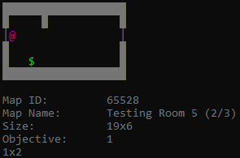
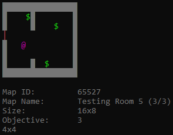
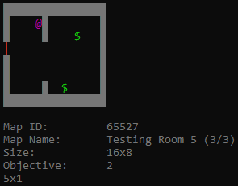
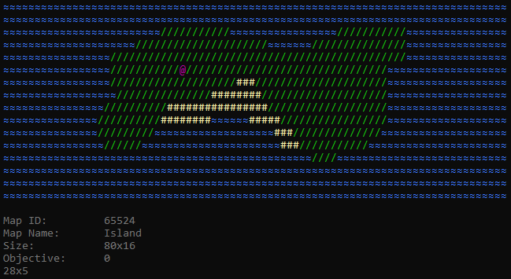
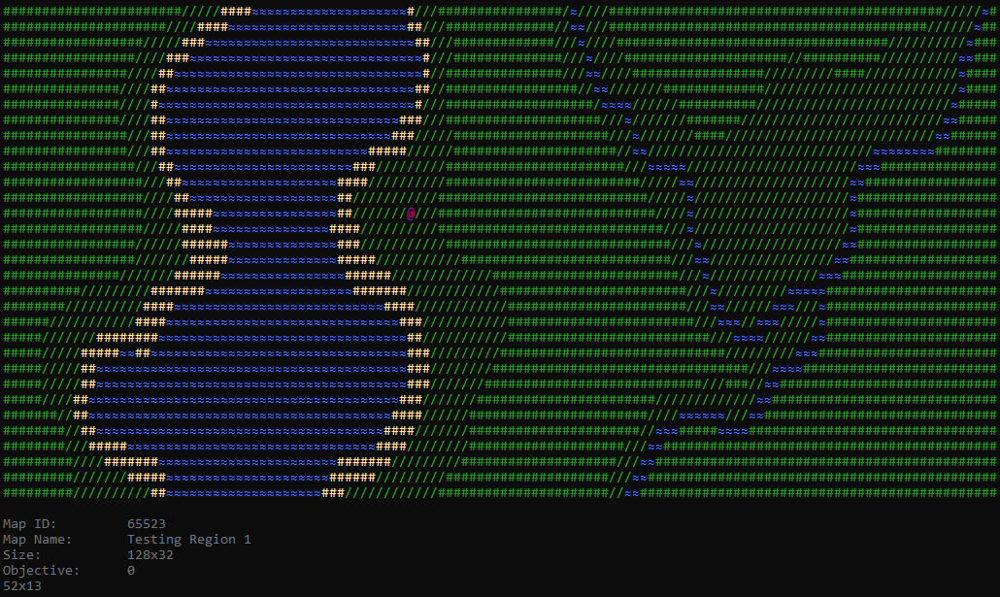

# C++ Game Tutorial
C++ tutorial for making a basic framework to easily construct a game with user made rooms and maps

## Why this Tutorial?
Some people have trouble figuring out what to do for a small project to continue their learning for a programming language. This C++ tutorial avoids the boring details of only covering data types, variables, etc. and applys the previous knowledge of the language to write a Windows console game from scratch.

## Project Preview
|||
|-|-|
|<em>Maps and rooms dynamically link to each other (1/2)</em>|<em>Maps and rooms dynamically link to each other (2/2)</em>|
|||
|<em>Objective count adjusts per map and room (1/2)</em>|<em>Objective count adjusts per map and room (2/2)</em>|
|||
|<em>ASCII island map with basic debug info</em>|<em>ASCII river map with basic debug info</em>|
